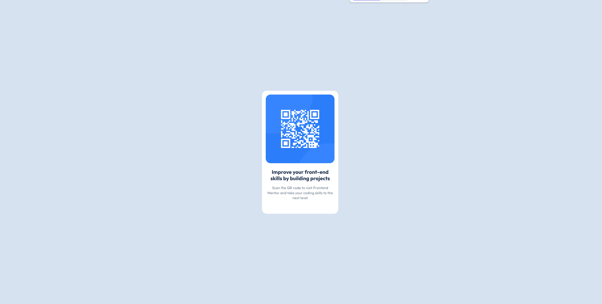

# Frontend Mentor - QR code component solution

This is a solution to the [QR code component challenge on Frontend Mentor](https://www.frontendmentor.io/challenges/qr-code-component-iux_sIO_H). Frontend Mentor challenges help you improve your coding skills by building realistic projects. 

## Table of contents

- [Overview](#overview)
  - [Screenshot](#screenshot)
  - [Links](#links)
- [My process](#my-process)
  - [Built with](#built-with)
  - [Useful resources](#useful-resources)
- [Author](#author)

## Overview

### Screenshot

### Links

- Live Site URL: [GitHub Pages](https://discipula99.github.io/FronteEnd-Mentor-Solution-1/)

## My process

### Built with

- CSS custom properties
- Flexbox
- Responsive Design

### Useful resources

- [Google-webfonts-helper](https://gwfh.mranftl.com/fonts) - This helped me to download the fonts I needed, It is more simple to choose the right weight you want.
- [nekoCalc](https://nekocalc.com/) - This is an amazing site to help you to calculate much faster the size fonts, from px to em and viceversa and much more. 

## Author

- Frontend Mentor - [@discipula99](https://www.frontendmentor.io/profile/discipula99)

